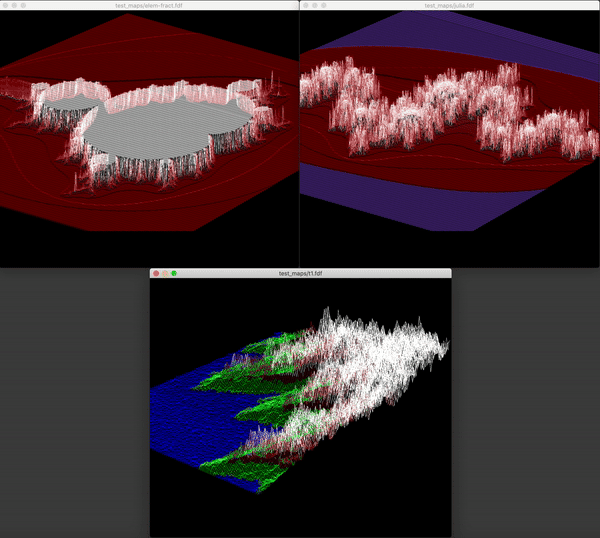

  <h3 align="center">FDF</h3>
  Rendering Coordinates in a 3D isometric view
   
   

 

# FDF

Fainéant Development Framework, is a key project in the 42 curriculum where we build a minimalist 2D map viewer. The project involves creating a tool that reads and displays elevation maps in a simple, pixelated format. Using only pure ANSI C and steering clear of modern libraries or frameworks, we focus on essential skills like graphics rendering and memory management. The aim is to develop a deep understanding of low-level programming while delivering a functional, efficient viewer for visualizing 2D terrain data.

 

## Distinctive Features

  - 🔍 Zooming in and out.
  - 🖼️ Included 2D view.
  - 📏 Control height of coordinates.

 

## How to run

- Go to root directory and run `make`
- Run `./fdf test_maps/42.fdf`
- Choose between different maps in `test_maps/`

 

## Program Controls

<<`keyboard iputs`>>

- `arrows` to move the map arround in the window.
- `+ and -` to zoom in and out.
- `1` to remove the elevated coordinates.
- `2` turns map from 2D t 3D.
- `3` turns map back to 3D.
- `esc` to quit the game.

 