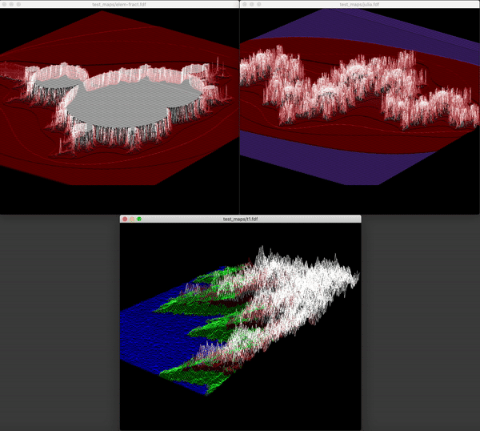

<div align="center">
  <a href="https://github.com/hadi14250">
    
  </a>

  <h1 align="center">FDF</h1>

  <p align="center">
    <i>Fil de fer</i> — a wireframe renderer that turns elevation maps into 3D isometric landscapes.
  </p>

  <br>

  <a href="https://github.com/hadi14250">
    
  </a>
</div>

<br>

## About

**FDF** is a graphics project from the [42 curriculum](https://42.fr/). It reads a `.fdf` map file containing a grid of elevation values and renders it as a 3D wireframe using an isometric projection.

The project is written from scratch in ANSI C using only the [MiniLibX](https://github.com/42Paris/minilibx-linux) graphics library and a custom `libft`. It exercises the fundamentals of computer graphics:

- File parsing and memory management
- Linear algebra: rotation, projection, scaling
- [Bresenham's line algorithm](https://en.wikipedia.org/wiki/Bresenham%27s_line_algorithm) for drawing line segments
- Real-time keyboard-driven transformations

<br>

## Features

- 🗺️ Isometric 3D projection of any well-formed `.fdf` elevation map
- 🔍 Zoom in and out on the rendered grid
- 📏 Adjust the terrain height (z-axis amplitude)
- 🎨 Elevation-based color gradients
- 🖼️ Toggle between flat 2D and isometric 3D views
- 🎮 Pan the map smoothly around the window

<br>

## Build & Run

```sh
make                       # compile the project
./fdf test_maps/42.fdf     # render one of the included maps
```

A variety of test maps live in `test_maps/`. Try a few to see different terrain shapes:

```sh
./fdf test_maps/pyramide.fdf
./fdf test_maps/julia.fdf
./fdf test_maps/elem-col.fdf
./fdf test_maps/pylone.fdf
```

<br>

## Controls

| Key         | Action                              |
| ----------- | ----------------------------------- |
| `← ↑ → ↓`   | Pan the map around the window       |
| `+` / `-`   | Zoom in / out                       |
| `1`         | Flatten elevation (remove z-axis)   |
| `2`         | Switch to 2D top-down view          |
| `3`         | Switch back to 3D isometric view    |
| `Esc`       | Quit                                |

<br>

## Project Layout

```
fdf.c                 entry point
parse_map.c           reads the .fdf file into a grid
parse_cords.c         tokenizes coordinate / color values
grids_and_points.c    builds the point matrix
bressen.c             Bresenham line drawing
visuals.c             isometric projection & rendering
movements.c           pan / zoom / height transforms
key_hooks.c           keyboard input handling
color_handle.c        per-point color logic
fdf.h                 shared types and prototypes
libft/                custom standard library
mlx/                  MiniLibX graphics library
test_maps/            sample .fdf maps
```

<br>

## Author

Built by [hadi14250](https://github.com/hadi14250) as part of the 42 curriculum.
